# Expense Tracker App

## 🚀 Live Demo

### 🔗 URLs

- 🌐 **Frontend:** [Expense Tracker Frontend](https://expensetracker-pp.onrender.com/)  
- 🔧 **Backend:** [Expense Tracker Backend](https://exptra-b.onrender.com/)  

You can use these links to access the application and its backend services. 🚀


## 📚 About the Project
The **Expense Tracker App** is a full-stack web application designed to help users manage their income and expenses efficiently. It provides a clean and intuitive interface for tracking financial transactions, categorizing expenses, and generating reports.

## 🔥 Features
- **User Authentication**
  - Login and Signup with secure authentication.
  - JWT-based authentication for security.
  - Password hashing using bcrypt.
  - Email confirmation via Nodemailer after signup.

- **Expense Management**
  - Add expenses and credits.
  - Categorize transactions for better tracking.
  - Filter expenses by category, type (expense/credit), and date.
  - Download expenses as a CSV file.

- **User Profile**
  - Choose an avatar for the user profile.
  - Securely store and manage user details.

- **Dashboard & Reports**
  - Dashboard displaying expense summaries.
  - Weekly expense summaries sent to registered users via email.
  
- **API & Backend**
  - RESTful APIs to manage users, expenses, and categories.
  - Middleware for authentication and validation.
  - MongoDB collections for users and expenses.

- **Other Features**
  - Mobile responsive frontend.
  - User-friendly UI for seamless navigation.

## 🛠 Tech Stack
- **Frontend:** React, React Router, Bootstrap, Toastify
- **Backend:** Node.js, Express.js, MongoDB, Mongoose
- **Authentication:** JWT, bcrypt
- **Email Service:** Nodemailer
- **Storage:** MongoDB Atlas

## 📌 Setup Instructions
1. Clone the repository:
   ```sh
   git clone https://github.com/PritiranjanPatra2/ExpenseTracker.git

## 📌 Screenshots

### Screenshot SignUp Page  
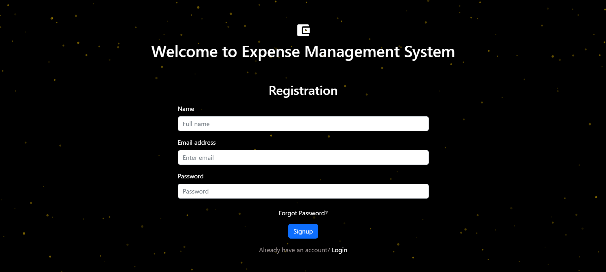  
**Description:** Signup page with fields for name, email, password, and password confirmation, allowing new users to register.
### Screenshot Email confirmation on signup
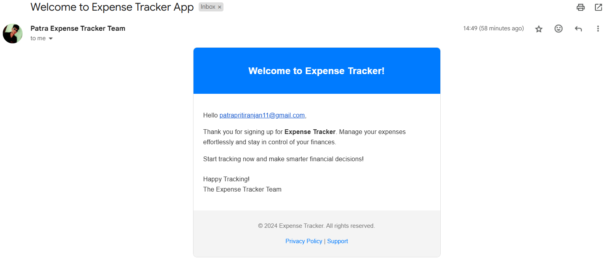
**Description:** In sucessfull signup Confirmation Message
### Screenshot Choose Avatar
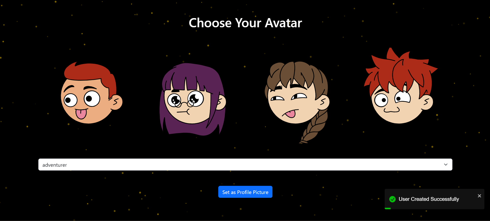
**Description:** Its saying to choose your avtar
### Screenshot Login Page
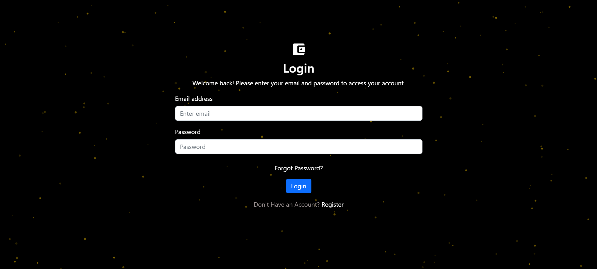
**Description:** Login page with email and password input fields with Login Button.
### Screenshot User
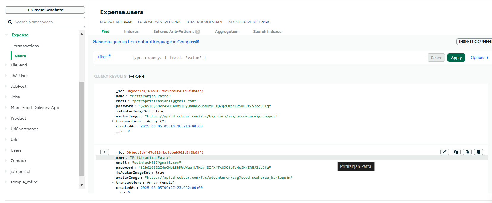
**Description:** User collection in MongoDB Atlas with fields for name, email, password, and avatarImage,transactions,createdAt.
### Screenshot 5
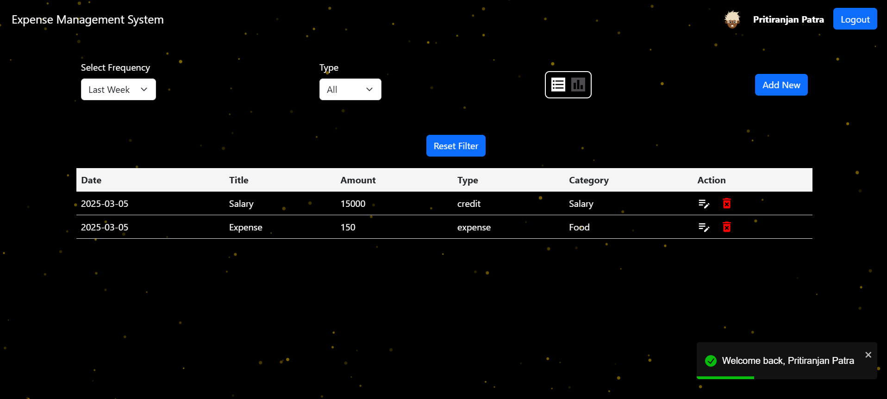
**Description:** Expense Tracker Dashboard with expense summary and add expense button.
### Screenshot Add Transactions

**Description:** Add transaction details page
### Screenshot Expenses
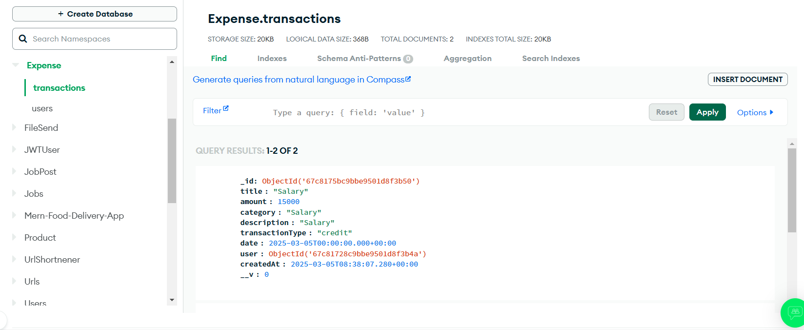
**Description:** Transactions collection in MongoDB Atlas with fields for title, amount, category,description,transactionType,date,user,createdAt.
### Screenshot ListOFExpensesAndCredits with Download CSV button
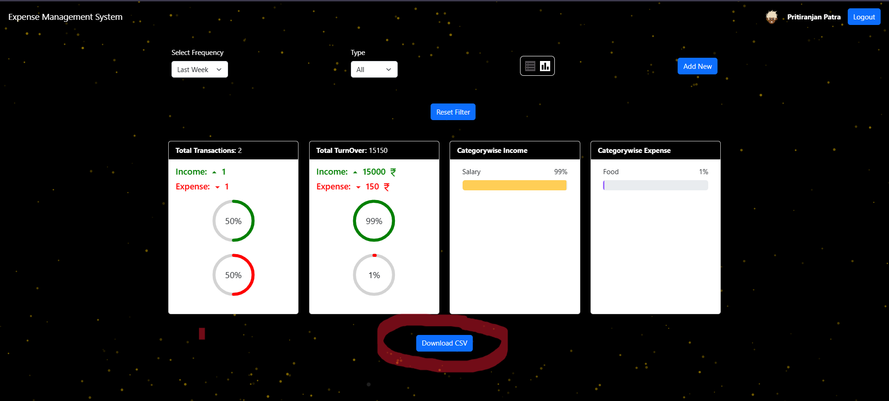
**Description:** This page displays a list of expenses along with a "Download CSV" button, allowing users to export their financial data in CSV format for further analysis or record-keeping. It helps users track and manage their expenses efficiently.
### Screenshot ExportCSV
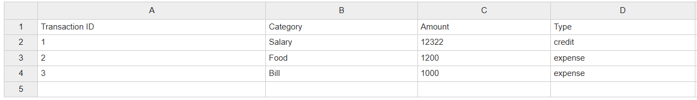
**Description:** After downloading the csv,the csv file should look like above
### Screenshot CategoryFilter
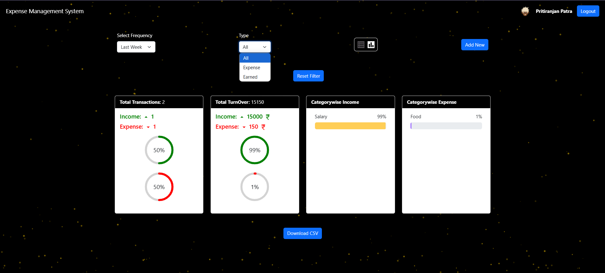
**Description:** Expense filtering by category
### Screenshot DateFilter
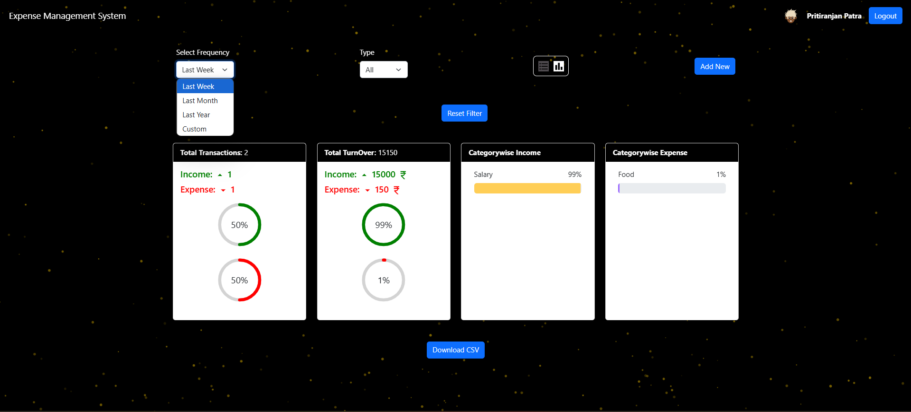
**Description:** Expense filtering by date
### Screesnshot MobileResponsive
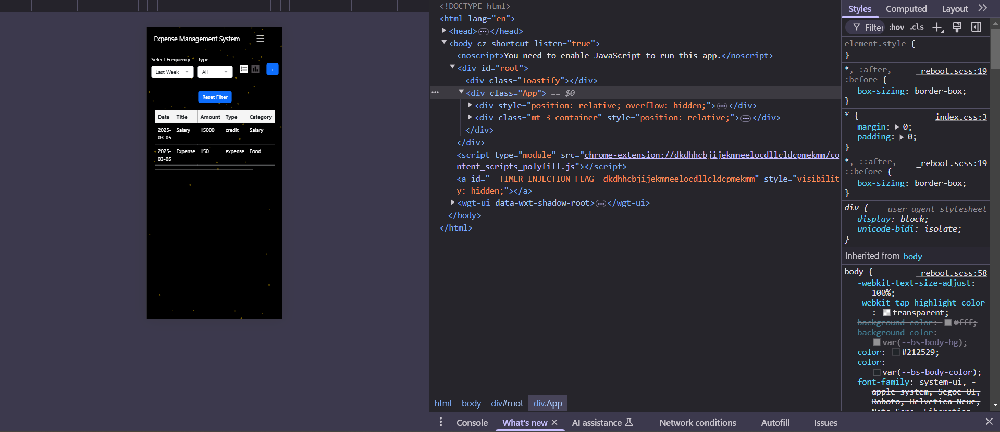
**Description:** Expense Tracker Dashboard on a mobile device, showing the same layout and functionality as the desktop