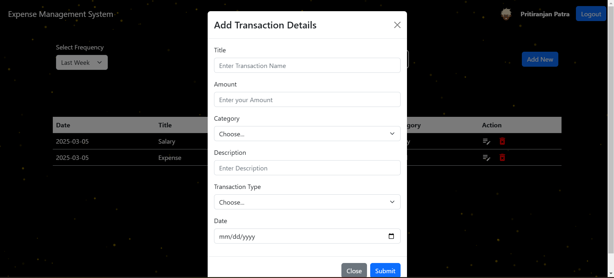

# Saving the README content as a file for the user to download

readme_content = """# Expense Tracker App

## 🚀 Live Demo
[Click here to use the app](https://expensetracker-pp.onrender.com/)

## 📚 About the Project
The **Expense Tracker App** is a full-stack web application designed to help users manage their income and expenses efficiently. It provides a clean and intuitive interface for tracking financial transactions, categorizing expenses, and generating reports.

## 🔥 Features
- **User Authentication**
  - Login and Signup with secure authentication.
  - JWT-based authentication for security.
  - Password hashing using bcrypt.
  - Email confirmation via Nodemailer after signup.

- **Expense Management**
  - Add expenses and credits.
  - Categorize transactions for better tracking.
  - Filter expenses by category, type (expense/credit), and date.
  - Download expenses as a CSV file.

- **User Profile**
  - Choose an avatar for the user profile.
  - Securely store and manage user details.

- **Dashboard & Reports**
  - Dashboard displaying expense summaries.
  - Weekly expense summaries sent to registered users via email.
  
- **API & Backend**
  - RESTful APIs to manage users, expenses, and categories.
  - Middleware for authentication and validation.
  - MongoDB collections for users and expenses.

- **Other Features**
  - Mobile responsive frontend.
  - User-friendly UI for seamless navigation.

## 🛠 Tech Stack
- **Frontend:** React, React Router, Bootstrap, Toastify
- **Backend:** Node.js, Express.js, MongoDB, Mongoose
- **Authentication:** JWT, bcrypt
- **Email Service:** Nodemailer
- **Storage:** MongoDB Atlas

## 📌 Setup Instructions
1. Clone the repository:
   ```sh
   git clone https://github.com/PritiranjanPatra2/ExpenseTracker.git

## 📌 Screenshots

### Screenshot 1  
  
**Description:** Signup page with fields for name, email, password, and password confirmation, allowing new users to register.
### Screenshot 2

**Description:** In sucessfull signup Confirmation Message
### Screenshot 3

**Description:** Its saying to choose your avtar
### Screenshot 4

**Description:** Login page with email and password input fields with Login Button.
### Screenshot 5

**Description:** Expense Tracker Dashboard with expense summary and add expense button.
### Screenshot 6

**Description:** Add transaction details page
### Screenshot 7

**Description:** This page displays a list of expenses along with a "Download CSV" button, allowing users to export their financial data in CSV format for further analysis or record-keeping. It helps users track and manage their expenses efficiently.
### Screenshot 8

**Description:** After downloading the csv,the csv file should look like above
### Screenshot 9

**Description:** Expense filtering by category
### Screenshot 10

**Description:** Expense filtering by date


